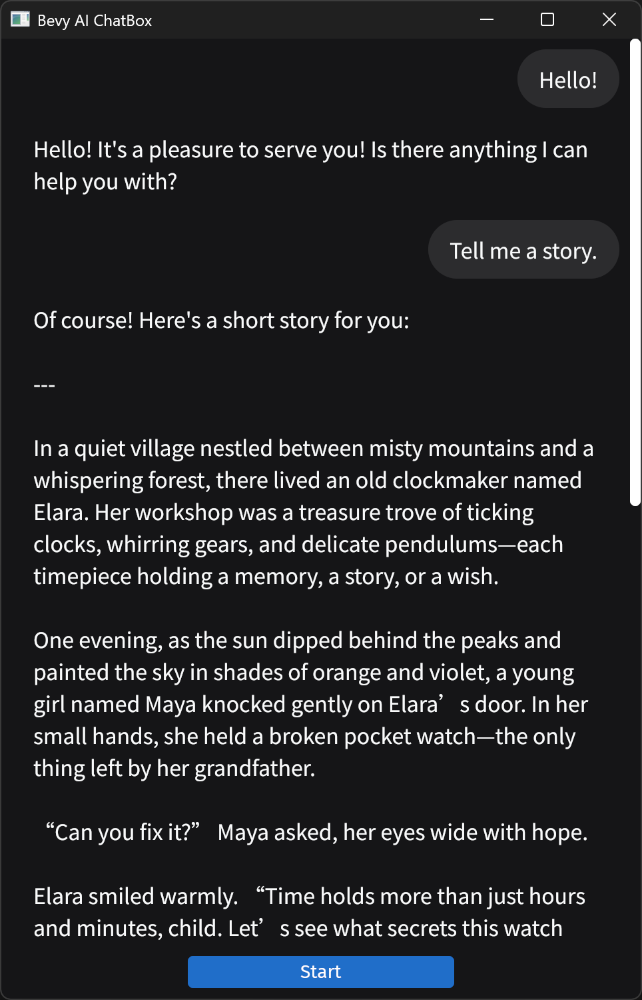

# Bevy AI ChatBox

A simple AI ChatBox implementation built with Bevy, currently supporting the DeepSeek API.

> [!WARNING]
> Development is on hold for the near future, as Bevy does not yet have native support for text input with IME.

## Preview

<div align="center">
    
</div>

## Build & Run

First, bundle the application using the provided script:

```shell
nu bundle.nu
```

Then, navigate to the `dist` directory and run the executable.